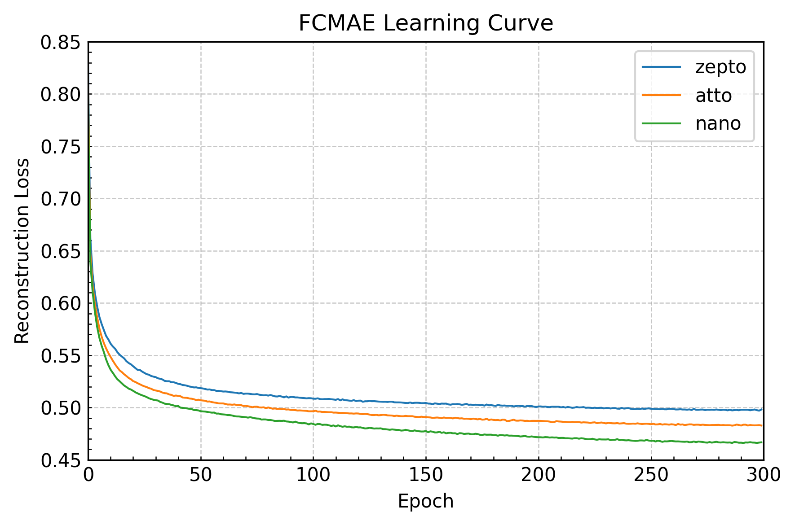
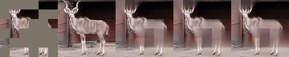
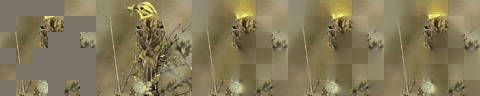
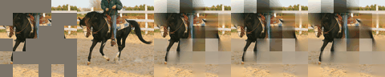
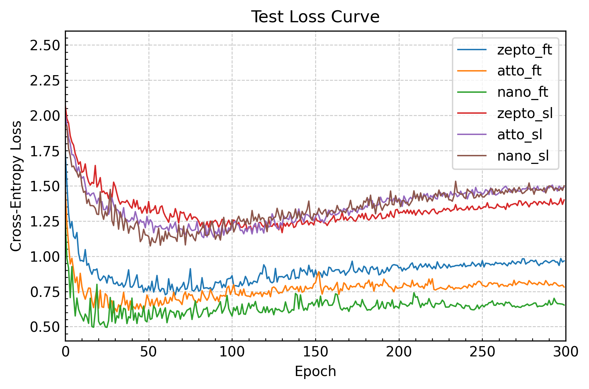
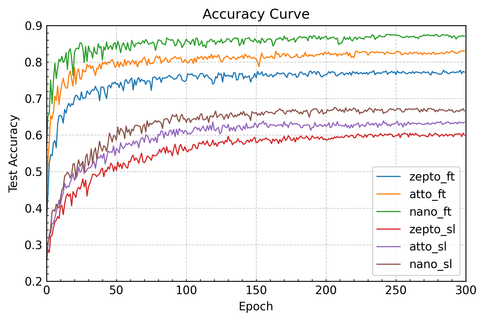

# FCMAE-torch

A minimal, flexible PyTorch implementation of the Fully Convolutional Masked AutoEncoder (FCMAE) with ConvNeXtV2, designed to operate **without** MinkowskiEngine and natively support non-square images.

## Features

- 🚀 **Pure PyTorch**: No MinkowskiEngine dependency
- 🖼️ **Non-square Image Support**: Works seamlessly with images of any aspect ratio
- 🛠️ **Readable & Extensible**: Clean codebase for easy customization

## Getting Started

### Installation

Clone the repository and set up the environment:

```bash
git clone https://github.com/BSP36/fcmae.git
cd fcmae
bash docker_run.sh
```

This command will build and launch a Docker container with all necessary dependencies pre-installed.

### Pre-training

Run the pre-training script. For example:

```bash
python pretrain.py --name test
```

Results will be saved to `./experiments/test`.
Currently, the codebase is configured for the STL10 dataset, but it can be easily adapted for other datasets.

To evaluate on datasets and visualize results, use:

```bash
python test_fcmae.py --name test
```

Inference visualizations are saved under `./experiments/test/results`.

### Fine-tuning

After pre-training, fine-tune your model with:

```bash
python finetune.py --pre test --name test_ft
```

- Use `--pre` to specify the pre-trained experiment name.
- Fine-tuned results are saved under `./experiments/test_ft`.

For baseline comparison, you can run supervised learning from scratch by adding the `--without_pre` flag.


## Pre-training Results
We pre-train three FCMAE variants of different scales:

|Model |stem_stride | depths | dims | Encoder Params |
|---|---|---|---|---|
| **zepto** | 4 | \[2, 2, 4] | \[40, 80, 160] | 1.07M|
| **atto** | 2 | \[2, 2, 6, 2] | \[40, 80, 160, 320] | 3.39M |
| **nano** | 2 | \[2, 2, 8, 2] | \[80, 160, 320, 640] | 14.98M |

* Default hyperparameters are used unless otherwise noted.  
* Complete hyperparameter settings are provided as YAML files under `./experiments`.  
* **atto** and **nano** configurations follow the original FCMAE paper for direct comparability.  

### Dataset

We use the **STL-10** dataset, which consists of:

* **unlabeled**: 100,000 images
* **train**: 10 classes × 500 images
* **test**: 10 classes × 800 images

Only the unlabeled split is used during pre-training.

### Training Dynamics
The reconstruction loss decreases stably throughout training:

</img>

### Quantitative Results
For each model, we report the final MAE loss across all dataset splits, with and without data augmentation:

|       | **w/o Aug.** |       |       | **w/ Aug.** |       |       |
| ----- | ------------ | ----- | ----- | ----------- | ----- | ----- |
| Model | Unlabeled    | Train | Test  | Unlabeled   | Train | Test  |
| zepto | 0.540 | 0.537 |0.537| 0.498 | 0.492 | 0.488|
| atto |0.527| 0.523 |0.523 | 0.483 | 0.477 | 0.473 |
| nano | 0.513 | 0.509 |0.509 | 0.467 | 0.461 | 0.456 |


**Observations:**

* Larger models consistently achieve lower reconstruction loss.
* Data augmentation slightly reduces loss, though the relative trend across model sizes remains unchanged.

### Qualitative Results

We also visualize reconstructed images for each split as **[masked, original, zepto, atto, nano]**:

* **Unlabeled**: 
  
  
* **Train**:
  
  
* **Test**:
  
  

## Fine-tuning vs. Supervised Learning
This section demonstrates the impact of FCMAE pre-training on downstream supervised learning performance using the STL-10 dataset. We compare models fine-tuned from FCMAE pre-trained weights against those trained from scratch.

Note that the purpose of these experiences is to analyze the learning dynamics of FCMAE pre-training and fine-tuning, rather than to achieve state-of-the-art results.
Thus, for fine-tuning, we use the STL-10 train split (10 classes × 500 images) without a train-validation split; the STL-10 test split (10 classes × 800 images) serves as the validation set.

Fine-tuning is performed for 300 epochs using AdamW (learning rate = 1.5e-4, batch size = 128), updating all encoder weights.

### Training Dynamics

</img>
</img>

* `_ft` refers to fine-tuning after FCMAE pre-training, while `_sl` indicates supervised learning from scratch (without FCMAE).
* FCMAE pre-training consistently improves performance for all model sizes.
* Test accuracy increases quickly during the early epochs of fine-tuning.

These results suggest that FCMAE pre-training enables the encoder to learn robust, non-local, and abstract representations.

### Accuracy & Macro F1
(in preparation)
<!-- | Model | Pre-training | Accuracy | Macro F1 |
| ----- | ------------ | -------- | -------- |
| zepto | w/ FCMAE     | …        | …        |
| zepto | scratch      | …        | …        |
| atto  | w/ FCMAE     | …        | …        |
| atto  | scratch      | …        | …        |
| nano  | w/ FCMAE     | …        | …        |
| nano  | scratch      | …        | …        | -->


### Confusion Matrix


## Conclusion
<!-- - FCMAE significantly improves the classification performance when the number of train data is short, while unlabeled data is available.
-  -->

## References
- [ConvNeXtV2](https://arxiv.org/abs/2301.00808)
- [STL10](https://cs.stanford.edu/~acoates/stl10/)

## License

This project is licensed under the MIT License.


<!-- |model | unlabeled| train| test| unlabeled | train | test|
|---|---|---|---|---|---|---|
| zepto | 0.5400 | 0.5365 |0.5366| 0.4979 | 0.4921 | 0.4877|
| atto |0.5269| 0.5232 |0.5233 | 0.4833 | 0.4774 | 0.4729 |
| nano | 0.5129 | 0.5088 |0.5094 | 0.4668 | 0.4606 | 0.4560 | -->
