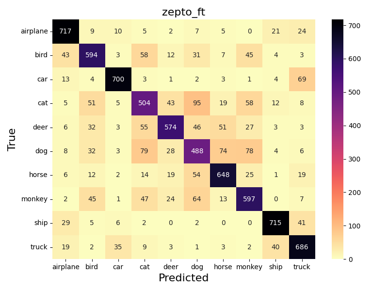
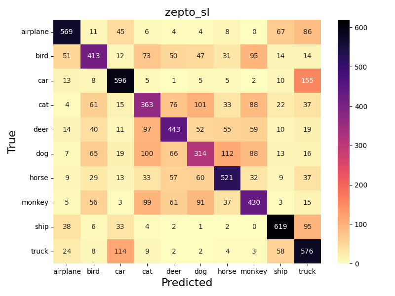
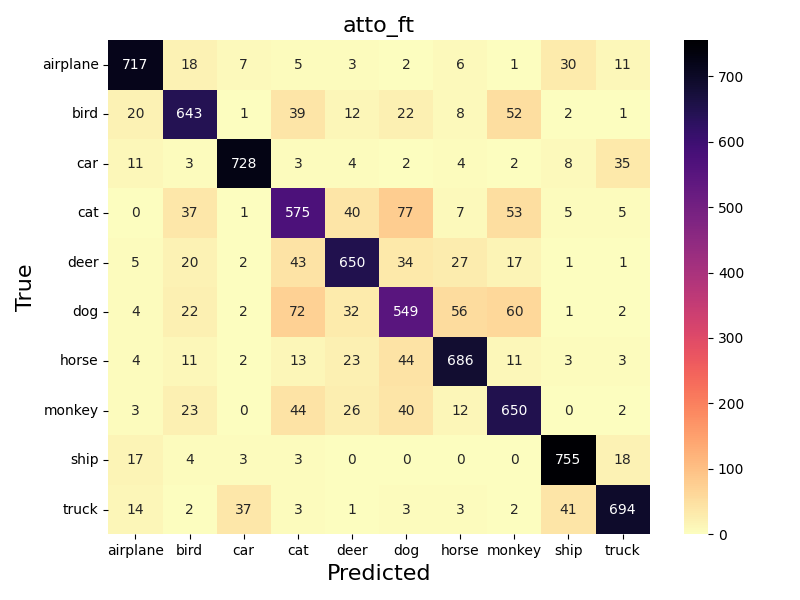
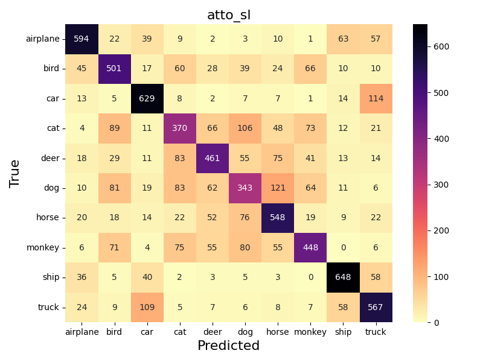
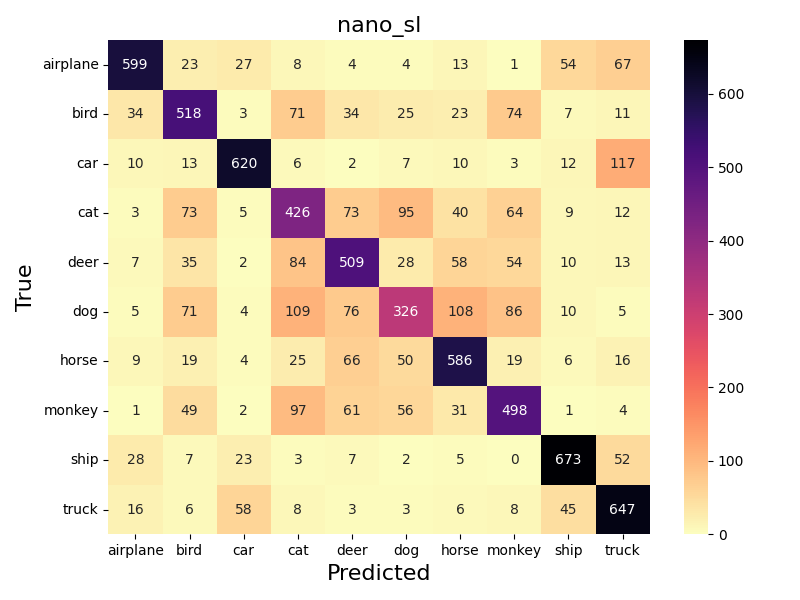

# FCMAE-torch

A minimal yet flexible PyTorch implementation of the **Fully Convolutional Masked Autoencoder (FCMAE)** with **ConvNeXtV2**, designed to run **without MinkowskiEngine** and to handle **non-square images natively**.
This repository aims to serve as both a **research baseline** and a **demonstration of clean, extensible implementation practices**.

## Features

* 🚀 **Pure PyTorch** – No dependency on MinkowskiEngine or other heavy frameworks
* 🖼️ **Flexible Input Shapes** – Now supports non-square image sizes
* 🛠️ **Readable & Extensible Codebase** – Easy to adapt for custom datasets, architectures, or research experiments

## Getting Started

### Installation

Clone the repository and build the environment:

```bash
git clone https://github.com/BSP36/fcmae.git
cd fcmae
bash docker_run.sh
```

This script sets up a Docker container with all required dependencies pre-installed, ensuring reproducibility across environments.

### Pre-training

To launch pre-training (default: STL10 dataset):

```bash
python pretrain.py --name test
```

* Results are stored in `./experiments/test`.
* The code is preconfigured for STL10 but can be easily extended to other datasets.

To evaluate and visualize reconstructions:

```bash
python test_fcmae.py --name test
```

Inference results are saved in `./experiments/test/results`.

### Fine-tuning

After pre-training, fine-tune the encoder on classification:

```bash
python finetune.py --pre test --name test_ft
```

* `--pre` specifies the name of the pre-trained experiment.
* Fine-tuned checkpoints and logs are stored in `./experiments/test_ft`.
* For baseline comparison, supervised learning from scratch can be run by adding the `--without_pre` flag.

### Checkpoints

We provide checkpoints and YAML configuration files under `./experiments` for reproducibility.
All checkpoint files are stored in **float16** format to reduce disk usage while maintaining negligible performance loss.


## Pre-training Results
We pre-train three FCMAE variants of different scales:

|Model |stem_stride | depths | dims | Encoder Params |
|---|---|---|---|---|
| **zepto** | 4 | \[2, 2, 4] | \[40, 80, 160] | 1.07M|
| **atto** | 2 | \[2, 2, 6, 2] | \[40, 80, 160, 320] | 3.39M |
| **nano** | 2 | \[2, 2, 8, 2] | \[80, 160, 320, 640] | 14.98M |

* Default hyperparameters are used unless otherwise noted.  
* Complete hyperparameter settings are provided as YAML files under `./experiments`.  
* **atto** and **nano** configurations follow the original FCMAE paper for direct comparability.  

### Dataset

We use the **STL-10** dataset, which consists of:

* **unlabeled**: 100,000 images
* **train**: 10 classes × 500 images
* **test**: 10 classes × 800 images

Pre-training is performed only on the unlabeled split.

### Training Dynamics
The reconstruction loss decreases stably throughout training:

</img>

### Quantitative Results
For each model, we report the final MAE loss across all dataset splits, with and without data augmentation:

|       | **w/o Aug.** |       |       | **w/ Aug.** |       |       |
| ----- | ------------ | ----- | ----- | ----------- | ----- | ----- |
| Model | Unlabeled    | Train | Test  | Unlabeled   | Train | Test  |
| zepto | 0.540 | 0.537 |0.537| 0.498 | 0.492 | 0.488|
| atto |0.527| 0.523 |0.523 | 0.483 | 0.477 | 0.473 |
| nano | 0.513 | 0.509 |0.509 | 0.467 | 0.461 | 0.456 |

**Observations:**

* Larger models consistently achieve lower reconstruction loss.
* Data augmentation slightly reduces loss, though the relative trend across model sizes remains unchanged.

### Qualitative Results

Reconstruction visualizations are shown as **\[masked, original, zepto, atto, nano]**:
* **Unlabeled**: 
  
  
* **Train**:
  
  
* **Test**:
  
  

## Fine-tuning vs. Supervised Learning
We evaluate the effect of FCMAE pre-training on downstream classification using STL-10.
Models fine-tuned from FCMAE are compared against those trained **from scratch**.

⚠️ The goal here is not to reach SOTA, but to analyze **learning dynamics** under limited data.

* Fine-tuning uses the STL-10 **train split** (10 classes × 500 images).
* The STL-10 **test split** (10 classes × 800 images) is used for validation.
* Optimization: **AdamW** (lr = 1.5e-4, batch size = 128, 300 epochs).
* All encoder weights are updated during fine-tuning.

### Training Dynamics

</img>
</img>

* `_ft` = fine-tuned after FCMAE pre-training
* `_sl` = supervised learning from scratch

**Observations:**

* FCMAE pre-training accelerates convergence and improves final accuracy.
* Gains are most notable in the early epochs, suggesting stronger initialization.
* Pre-trained encoders capture robust, abstract features transferable to classification.


### Accuracy & Macro F1

Top-1 Accuracy and Macro F1 on the STL-10 test set:

| Model | Accuracy (w/ FCMAE) | Accuracy (scratch) | Macro F1 (w/ FCMAE) | Macro F1 (scratch) |
|-------|---------------------|--------------------|----------------------|--------------------|
| zepto | 0.778               | 0.605              | 0.778                | 0.603              |
| atto  | 0.831               | 0.639              | 0.831                | 0.636              |
| nano  | **0.875**               | 0.675              | **0.876**                | 0.673              |

**Summary:** FCMAE pre-training improves both Accuracy and Macro F1 by \~20 points across all model sizes.

> Note: We did not apply advanced augmentation (e.g., CutMix) or extensive hyperparameter tuning. Furthermore, larger backbones (e.g., ConvNeXtV2-Base, 89M params) are expected to surpass **90% accuracy**, though at significantly higher computational cost.


### Confusion Matrix
Confusion matrices illustrate class-level behavior:
* **Zepto**: 

  </img>
  </img>

* **Atto**: 

  </img>
  </img>

* **Nano**: 

  </img>
  </img>


**Observations:**

* Common error patterns (e.g., confusing dog with cat or car with truck)
* Pre-training with FCMAE contributes to consistent improvements across all regions of the confusion matrix, including these challenging cases.

## Conclusion

* FCMAE substantially enhances classification performance under limited labeled data by leveraging unlabeled images.
* Gains are consistent across scales, highlighting the method’s robustness.


## References
* [ConvNeXtV2](https://arxiv.org/abs/2301.00808)
* [STL-10 Dataset](https://cs.stanford.edu/~acoates/stl10/)

## License

This project is licensed under the MIT License.